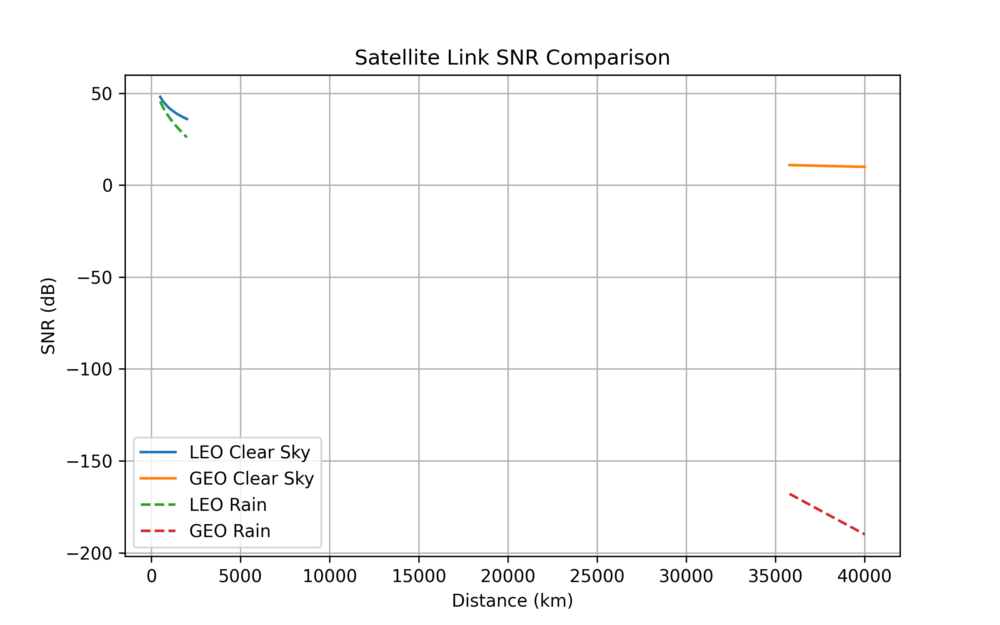
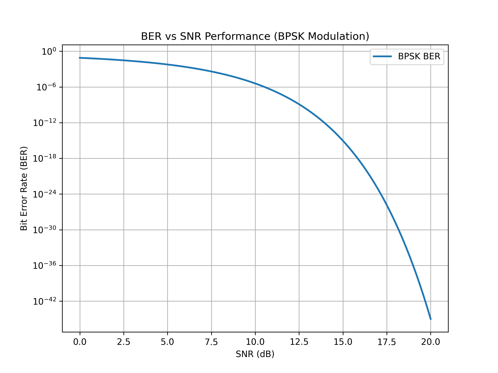
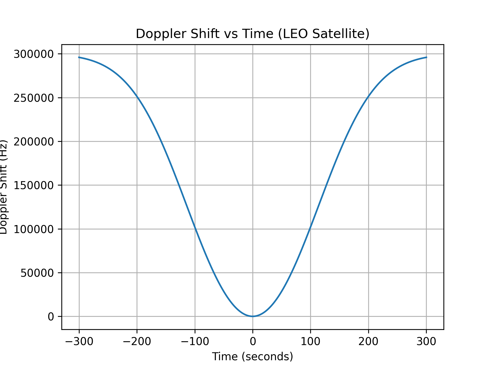
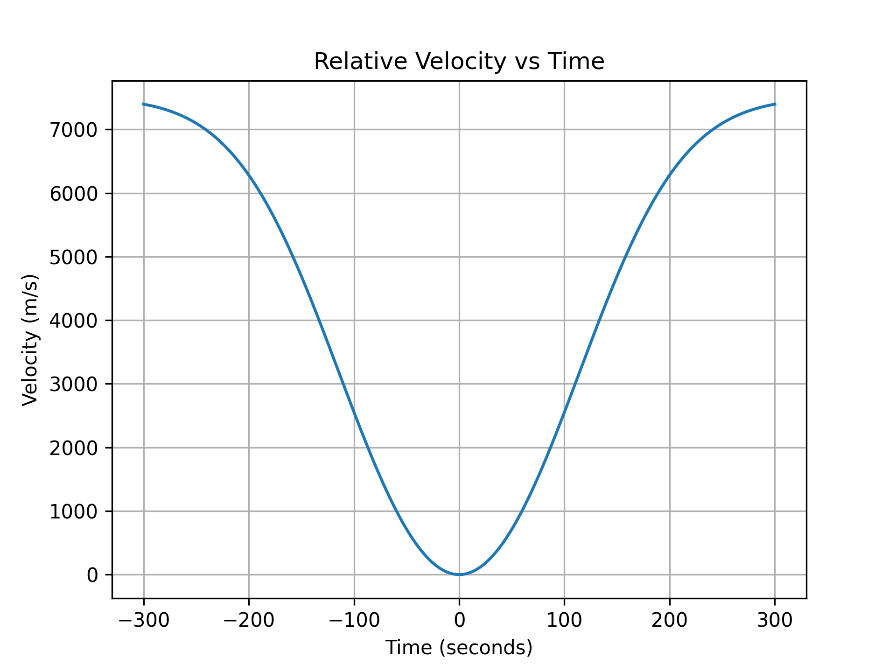
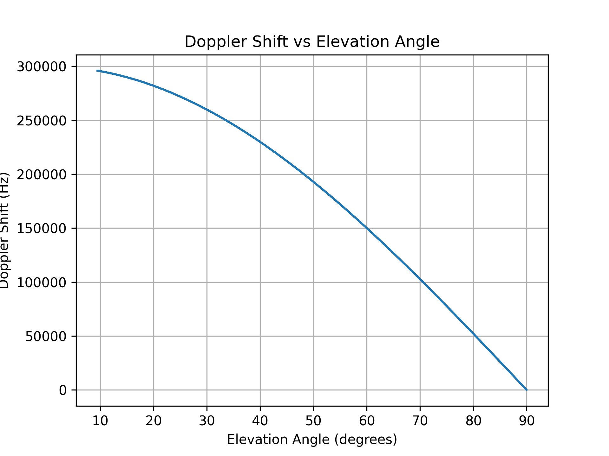

# satellite-communication-simulator

Simulation of satellite communication link including link budget, BER analysis, and Doppler shift modeling using Python

## Features

- Link Budget Analysis
- Signal-to-Noise Ratio (SNR) Modeling
- Bit Error Rate (BER) Analysis
- Doppler Shift Simulation for LEO Satellites

## Technologies Used

- Python
- NumPy
- Matplotlib

## Results

### SNR Comparison

### BER Analysis

### Doppler Shift Analysis

### Relative Velocity

### Doppler vs Elevation

## Author

**Kabyasri Bharali**  
Electronics & Telecommunication Engineering Student  
India
